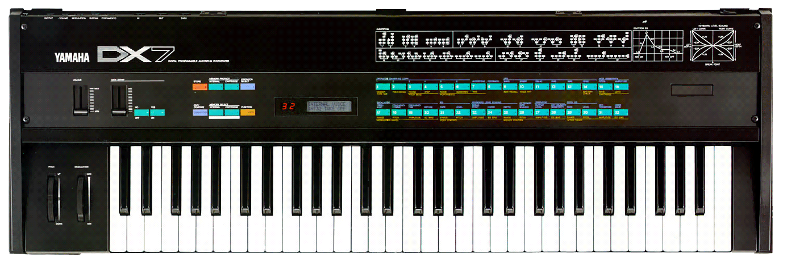

DX7 Synth JS
=================

DX7 FM synthesis using the Web Audio and Web MIDI API. Works in Chrome and Firefox.
Use a MIDI or QWERTY keyboard to play the synth.

[Live demo of DX7 Synth JS](https://mmontag.github.io/dx7-synth-js/)

Controls: 

1. **QWERTY keys** to play notes
1. **Space bar** panic (all notes off)
1. **Control** hold down to increase QWERTY velocity
1. **Mouse wheel** over knobs and sliders to increase/decrease value
1. **Click or touch and drag up/down** on knobs and sliders to increase/decrease value
1. **Arrow up/down** on knobs and sliders to increase/decrease value
1. **Tab** moves between controls

Many thanks to:

- John Chowning and Yamaha
- Sean Bolton, author of Hexter, a DSSI DX7 modeler
- Phil Cowans, author of Javascript-DX7 music hackday prototype https://github.com/philcowans/Javascript-DX7
- Jamie Bullock, Ewan Macpherson, and other independent engineers who provided specs about the DX7/TX7 implementation
- Propellerhead Software, for the PX7 Reason Rack Extension
- Native Instruments, for the FM7 and FM8 VSTi software instruments
